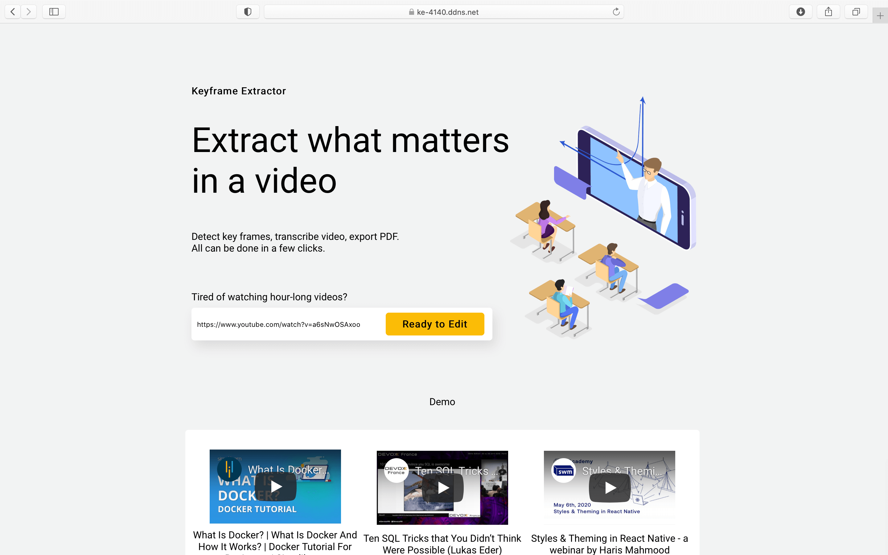

# Key Frame Extractor
 
Extract important frames from your hour-long webinars.
 
 
The application is deployed to https://ke-4140.github.io
 

## Repositories
* [ke-docker](https://github.com/ke-4140/ke-docker) - Docker configuration for deploying the backend
* [ke-backend](https://github.com/ke-4140/ke-backend) - Backend written with Laravel and Python
* [ke-frontend](https://github.com/ke-4140/ke-frontend) - Frontend repo written with React

## Features
* Allow automatic key frame extraction from a recorded lecture video
* Associate transcript with the extracted key frames
* Provide a web interface to edit the timestamp of the generated key frames
* Allow the key frames and transcript to be exported to a PDF file

## Stack Used
* Frontend: React
* Backend: Laravel PHP, Python (Pafy, OpenCV, scikit-image), MySQL, S3

## Installation
Please visit [ke-docker](https://github.com/ke-4140/ke-docker) for the installation guide.
